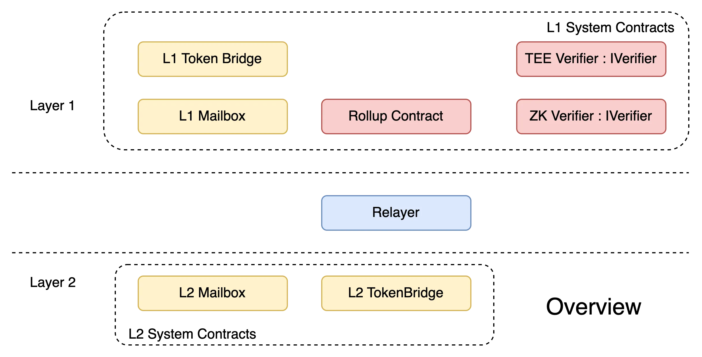
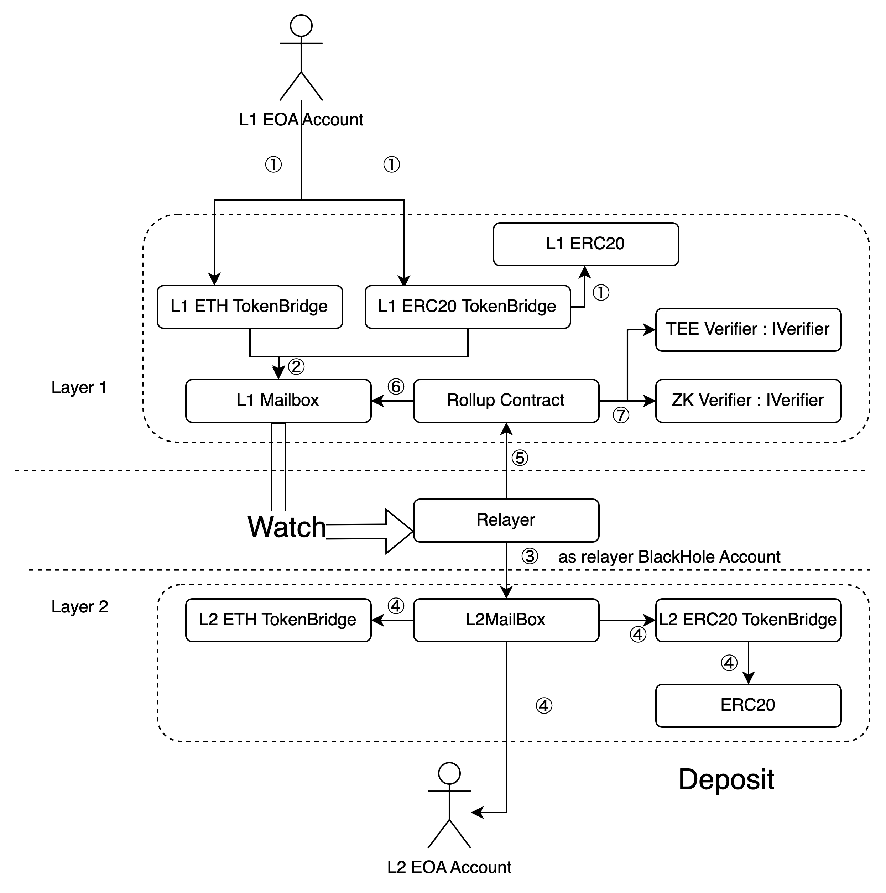
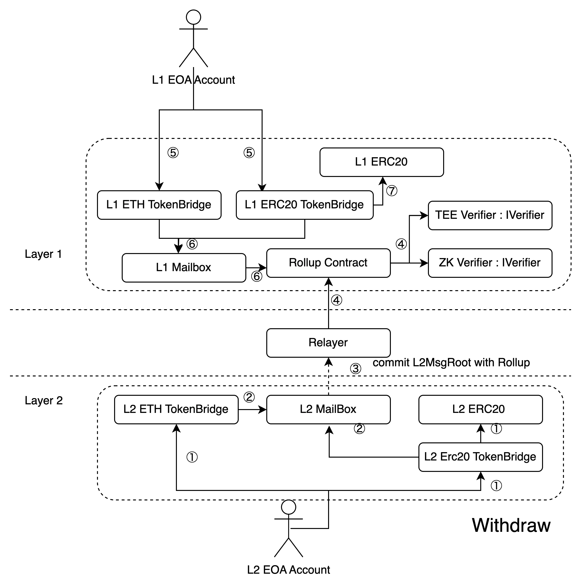

Bridge Contract Design
=========================

The bridge system is the hub connecting L1 and L2, providing two major functions: batch packaging of L2 transactions to L1 for verification; cross-chain bridges between L1 and L2, such as L1's Deposit, L2's Withdraw, and the escape hatch that will be supported soon. The bridge system includes the following modules, as shown in the figure below:

1. Rollup contract: This part of the contract is deployed on L1, including Rollup Contract, Tee Verifier, and ZK Verifier.
2. Cross-chain bridge contract: This part of the contract is deployed on L1 and L2 respectively, including L2 Mailbox, L2 TokenBridge, L1 Token Bridge, and L1 Mailbox.
3. Relayer service: This service is an independent off-chain service that provides communication capabilities for Rollup contracts and cross-chain bridge contracts on L1 and L2.

****

Figure17：Overall Logical View of Bridge System

## 7.1.Rollup and Cross-chain Asset Bridge
Rollup is the submission of L2 transactions to L1 in batches, and carries the corresponding proof, which includes three sub-processes (see the figure below): batch submission, batch proof based on trusted hardware, and batch proof based on zero knowledge, which have been described in the technical overview-transaction process and will not be repeated here.

Next, the process of asset cross-chain bridge will be described. First, the L1 Deposit process will be described, that is, users can recharge ETH or ERC20 Token to the L2 EOA account by calling the L1 TokenBridge contract, as shown in the figure below:

Figure18：Bridge System Deposit Process

1. The user sends ETH or ERC20 to the deposit method of the TokenBridge contract. TokenBridge generates L1 Msg of the corresponding asset mint in the L2 corresponding ERC20 contract and submits it to the L1 Mailbox contract
2. The L1 Mailbox contract adds the message to the Mailbox list
3. Relayer listens to the L1 Mailbox transaction event, and then sends a transaction of type L1 Msg (unsigned) to the Sequencer
4. L2 TokenBridge receives the transaction and calls the corresponding L2 ERC20 contract mint method to mint the corresponding asset for the user; if it is a native token, the L2 MailBox transfers the L2 native token to the user through the L2 TokenBrige
5. At the same time, Relay will fill the L1 Mailbox list index where the deposit transaction is located in the Batch and commit it to the Rollup contract
6. Rollup queries the L1 Mailbox contract for the corresponding L1 Msg based on the deposit transaction index information in the Batch. The Rollup contract then combines the information of L1 Msg and Relayer Commit, calculates the Public input, and generates a commit.
7. The Rollup contract verifies Veirfier with commit, and after verification, notifies the mailbox to delete the verified message.

The following is the L2 Withdraw process, that is, users can trigger the withdrawal of ETH or ERC20 by calling the L2 TokenBridge contract

Token to L1 EOA account, as shown below:

Figure19：Bridge System Withdraw Process

1. The user calls the L2 TokenBridge contract to transfer ETH or ERC20 to the corresponding TokenBrige; if it is ERC20, the L2 TokenBrige contract calls the burn method of the L2 ERC20 contract to destroy the corresponding assets
2. The L2 TokenBrige sends a message to the L2 Mailbox, indicating that the number of L2 assets has been destroyed. The Mailbox contract will record the destruction message in the MsgList and calculate the MsgRoot
3. The Relayer rolls up the newly generated L2 block and carries the MsgRoot of the last block of the Batch in the Batch Header; when the circuit and TEE record the Public Input, they will also read the MsgRoot from their own proven write set and put it in the Public input.
4. The block passes the verification. This verification ensures that the MsgRoot in the BatchHeader is calculated from the system contract. After the verification, the MsgRoot is saved in the Rollup contract. The MsgRoot recorded in the Rollup contract will be used for verification in subsequent withdrawal operations.
5. The user calls the withdraw_with_spv_proof method of L1 TokenBrige, providing the SPV proof of the L2 destruction message associated with Msg root and the Batch Index where MsgRoot is located.
6. The L1 TokenBrige contract calls the Rollup contract to query MsgRoot and verify the correctness of the SPV proof and the message.
7. After the L1 TokenBrige contract checks that the message is correct, it confirms that L2 has burned the corresponding assets, unlocks the L1 assets and sends them to the user.

## 
