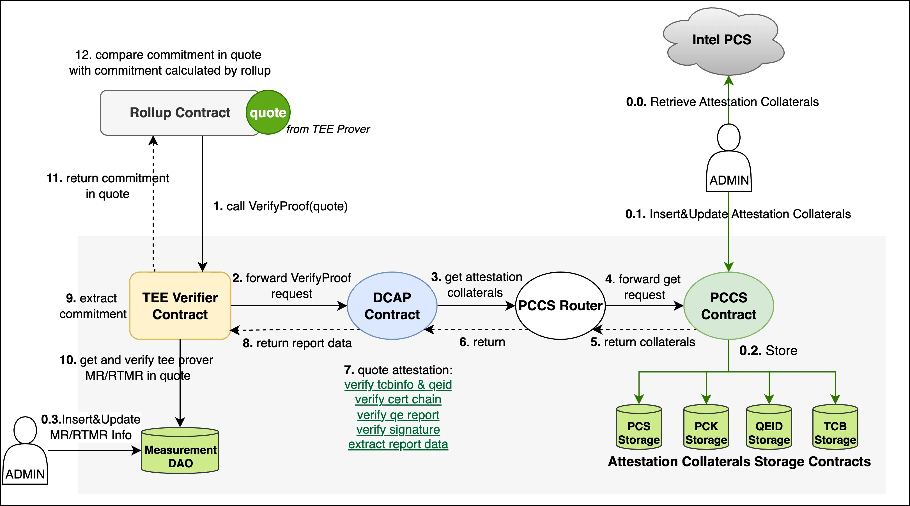
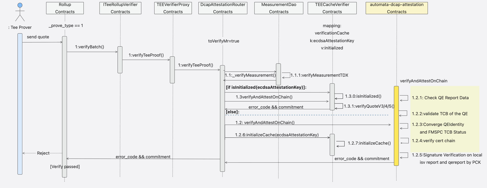

# TEE Verifier Overall Design

## Module
The TEE verifier Contract is responsible for verifying the credibility of the TEE quote received from the rollup contract. Upon successful validation, the commitment contained within the quote is extracted and returned to the rollup contract. The rollup contract then compares this commitment with its locally computed hash value.

The TEE attestation contract architecture consists of** 7 components:** TeeVerifierProxy, MeasurementDAO, DCAPAttestationRouter, TEECacheVerifier，AutomataDcap (as libraries) and AutomataPCCS (as libraries), and the P256Verifier (as libraries) contract.

+ **TeeVerifierProxy**: Implements the ITeeRollupVerifier interface. In the verifyProof function, the request is forwarded to the DCAPAttestationRouter contract.  
+ **DCAPAttestationRouter**: Stores the address of the AutomataDcap contract, and provides an interface to update this address—accessible exclusively to the owner. Upon receiving the verification result, the commitment is extracted from the return value.  
+ **TEECacheVerifier:** Implements caching, updating, deletion, clearing, and verification of the TEE AK (cedsaAttestationKey) based on the cached key.
+ **MeasurementDAO**: Maintains the MRSigner, MREnclave，RTMREnclave，MRTD values of the TEE Prover.  
+ **AutomataDcap (Library)**: Provides a set of functions to validate the certificate chain, tcbinfo, enclave identity, and other attributes within the quote. Upon successful verification, a serialized structure is returned, containing the user data—specifically, the commitment.  
+ **AutomataPCCS (Library)**: Provides a set of contracts for storing auxiliary data required during quote verification. The contract owner holds the authority to upsert these materials. During verification, the AutomataDcap contract retrieves the necessary validation data from AutomataPCCS.  
+ **P256Verifier (Library)**: Responsible for performing P-256 signature verification.

## Invocation Flow

### **Code path:** 
contracts/L1/tee_verifier

+ **TeeVerifierProxy**: contracts/L1/tee_verifier/src/TEEVerifierProxy.sol
+ **DCAPAttestationRouter**: contracts/L1/tee_verifier/src/DCAPAttestationRouter.sol
+ **TEECacheVerifier:** contracts/L1/tee_verifier/src/TEECacheVerifier.sol
+ **MeasurementDAO**: contracts/L1/tee_verifier/src/MeasurementDao.sol
+ **AutomataDcap (Library)**: contracts/L1/tee_verifier/sh/patch
+ **AutomataPCCS** : **integrated open-source implementation**
+ **P256Verifier** : **integrated open-source implementation**

### **Audit Scope**
src: contracts/L1/tee_verifier/src/

patch:contracts/L1/tee_verifier/sh/patch

_The following code bases __**DO NOT**__ need to be audited:_

+ _contracts/L1/tee_verifier/script_
+ _contracts/L1/tee_verifier/test_

### Breakdown by Directories
| Directory | Code Module | Loc(sol) | Priority |
| --- | --- | --- | --- |
| src  | TEEVerifierProxy | 64 | P0 |
| | DCAPAttestationRouter | 170 | P0 |
| | TEECacheVerifier | 273 | P0 |
| | MeasurementDao | 190 | P0 |
| | interfaces | 12 | P1 |
| patch | 0001-support-v5-quote | 556 | P0 |
| | 0001-bugfix-collaterals-expiration-check | 26 | P0 |
| **Total** |  | 1291 |  |
| **P0 Total** |  | 1279 |  |

### **Breakdown by Logic Components**
| Component | Code Module | Loc(sol) | Priority |
| --- | --- | --- | --- |
| TEEverifier | src/TEEVerifierProxy | 64 | P0 |
| | src/DCAPAttestationRouter | 170 | P0 |
| | src/TEECacheVerifier | 273 | P0 |
| | src/MeasurementDao | 190 | P0 |
| | src/interfaces | 12 | P1 |
| AutomataDcap | patch/0001-support-v5-quote | 556 | P0 |
| | patch/0001-bugfix-collaterals-expiration-check | 26 | P0 |
| **Total** | | 1291 | |

